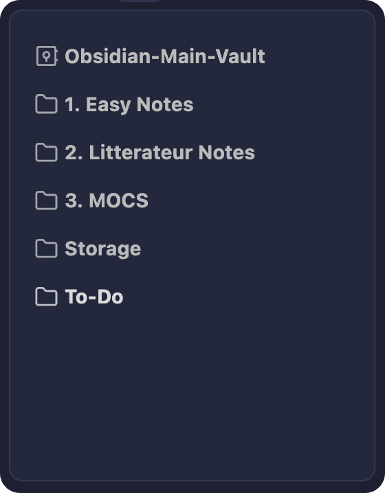
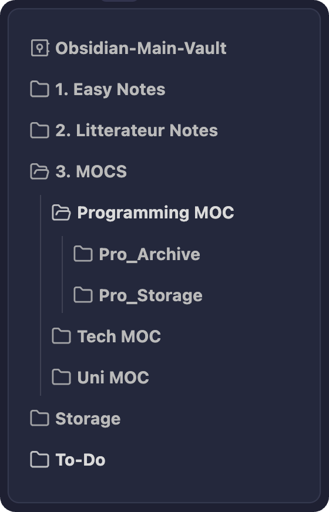
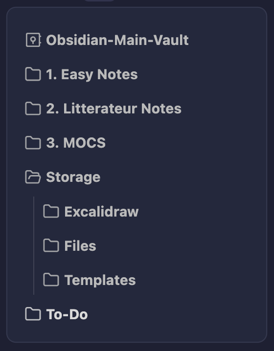

# Obsidian-Shared-Vault
**This is how I set up and use Obsidian for University and Programming note taking**

- If you download this repository, you will be able to open it with Obsidian. 
- The vault already has all the plugins that you need to use it.

---
# Table of content

- [Hot-Keys](#Hot-Keys)
- [Plugins](#Plugins)
- [Folder Organisation and Description](#Folder-Organisation-and-Description)
- [Work-Flows](#Work-Flows)
	- [Creating New Notes](#Creating-New-Notes)
  	- [Managing new notes and files](#Managing-new-notes-and-files)
  	- [Workspace Layouts](#Workspace-Layouts)
- [Latex](#Latex)
- [Theme Customisation](#Theme-Customisation)

---
# Hot-Keys

These are my customs or frequently used hot keys.

| Key                                       | Description   |
| ----------------------------------------- | ------------- |
| ```cmd``` + ```p``` |  Open command palette |
| ```cmd``` + ```s``` | Search in all files |
| ```cmd``` + ```shift``` + ```s``` | Show file explorer |
| ```cmd``` + ```shift``` + ```f``` | Search and replace in current file  |
| ```cmd``` + ```f``` |  Search current file |
| ```cmd``` + ```d``` |  Toggle right side bar |
| ```cmd``` + ```shift``` + ```d``` |  Toggle left side bar |
| ```cmd``` + ```r``` | Load workspace layout |
| ```cmd``` + ```shift``` + ```r``` | Save and load workspace layout |
| ```cmd``` + ```i``` | Toggle reading view |
| ```control``` + ```w``` or ```cmd``` + ```w```|  Close current tab |
| ```control``` + ```shift``` + ```w``` |  Undo close tab |
| ```control``` + ```shift``` + ```←``` | Navigate back  |
| ```control``` + ```shift``` + ```→``` | Navigate forward |
| ```control``` + ```tab``` | Go to the next tab  |
| ```control``` + ```shift``` +```tab``` | Go to the previous tab  |
| ```control``` + ```shift``` + ```←``` | Navigate back |
| ```control``` +  ```shift``` + ```→``` | Navigate forward |

---
# Plugins

These are all the **Community Plugins** that I use.

|    Plugins                                | Description   | Config | Work Flow |
| ----------------------------------------- | ------------- | --------- | --------- |
| [Folder Note](https://github.com/xpgo/obsidian-folder-note-plugin) | Adds a description note to folders  |    |  |
| [Latex Suite](https://github.com/artisticat1/obsidian-latex-suite) | Typesetting LaTeX math as fast as handwriting |    |  [link](#Latex-Configuration) |
| [Relative Line Numbers](https://github.com/nadavspi/obsidian-relative-line-numbers)| Adds relative line numbers to the editor |   |  |
| [Obsidian Git](https://github.com/denolehov/obsidian-git) | Vesion control and back up your Obsidian vault using Git |  |  |
| [Quick Add](https://github.com/chhoumann/quickadd) | Powerful combination of four tools: templates, captures, macros ... |    | [link](#Crrating-New-Notes) |
| [Style Settings](https://github.com/mgmeyers/obsidian-style-settings) | Customisation settings for obsidian themes |    | [link](#Theme-Customization) |
| [Tab Switcher](https://github.com/Vinzent03/tab-switcher) | alt-tab style switching between tabs   |    |   |

---
# Folder Organisation and Description

#### Key Features:
- **Modularity:**
	- I want all my notes to divided in folder by category (example: university notes, Coding and technical notes, Journaling ...).
	- This is important because i can treat them as separated vaults (example: one day i could decide to remove all my university notes from my main vault and make the in a new separate one).
- **Easily maintainable:** Creating new notes and organising them should be easy and fast.

## Folder Structure
**Index:**
- [Easy Notes folder](#Easy-Notes-folder)
- [Literature Notes folder](#Literature-Notes-folder)
- [Mocs folder](#Mocs-folder)
- [Storage folder](#Storage-folder)
- [To-Do folder](#To-Do-folder)



## Easy Notes folder  
This folder has **no rules**, i usually save here:
- *Small notes* that i don’t know where to save.
- Random *thoughts and ideas*.

## Literature Notes folder
This folder has only one rule, the notes need to be long and well written. I usually save here:
- Long and articulated notes that i don’t know where to save.
- Books/Films/Games summaries.
- Elaborations of the notes that are in the "Easy Notes" folder.

## Mocs folder



This is my main and *most important folder*, It contains other folders (subfolders), and every subfolder has is own topic.

>[!note]
>I have here only groups of notes that i want to treat as separated vaults. 

**Every subfolder as a precise structure:**
```
sub_folder
	- sub_moc.md
	- sub_foler_archive
	- sub_folder_storage
```

- **sub_moc.md:** a map of content (index) where you can link notes related the the main topic of the folder.
- **sub_folder_archive:** folder where you can save all the notes related to the topic.
- **sub_folder_storage:** folder where you can save all the files and attachments related to the notes in the archive folder (example: images, pdfs, ...).

## Storage folder



This is a general folder where i store all the files, media and templates of the vault that don't fit in the categories of the [Mocs folder](#Mocs_folder).

## To-Do folder

- Folder set as default location for all the new notes and attachments, (read: [how to set a default folder for new notes and attachments](/README_media/How_to.md).
- This folder also contains a note called To_Do.md, in this note a write all the things that a have to do/write/adjust in the vault.

**Read:** [Managing new notes and files](#Managing-new-notes-and-files) for more information.


---
# Work-Flows

## Creating New Notes

> All new note, files and media are initially saved in the **To-Do** folder, and later can be sorted in the right folders.

**Base metods:**

| Key                                       | Description   |
| ----------------------------------------- | ------------- |
| ```cmd``` + ```n``` | Create new note |
| ```cmd``` + ```shift``` + ```n```| Create new note to the right |

>[!note]
> - In the settings you can change the default location for new notes (read: )

**Advanced method:**
Creating a new note from a not existing but already defined note (using 
[quickadd plugin](https://github.com/chhoumann/quickadd)).
1. Highlight the note name.
2. Press ```cmd``` + ```t```.
3. Select the template.

> [!note] 
> - This method is implemented using the [quickadd plugin](https://github.com/chhoumann/quickadd) , you can **add new templates** going to the settings of this plugin.
> - You can also **specify the folder where you want to create the new note** in the plugin settings (example: "uni note" template creates a note in the "uni_archive" folder).


**Example:**

https://github.com/Jaxkeeper/Obsidian-Shared-Vault/assets/116072651/6dc6f184-d32d-4fff-96a3-b0e27a479e5d

---
## Managing new notes and files
**New Notes:**
- As seen in [Creating New Notes](#Creating-New-Notes) all the notes created with the ```cmd``` + ```t``` hot-key are already created in the right folder so you don't have to manage them.

- If you create a note without using the ```cmd```+ ```t``` method or you have crated a random note that doesn’t fit any of your templates, it will be saved in the **To-Do Folder**.

**New Files:**
- All new files when imported in the vault are saved in the **To-do folder**.

> When you have some spare time you can open this folder and move all the files in the right folders (example: if you have a university related image you can move it to the "uni_storage" folder).

---
## Workspace Layouts

> To use this workflow you have to turn on the ```Workspaces plugin``` in the core-plugins settings.

**Create a new workspace layout:**
1. Presa ```cmd``` + ```p``` to open command palette.
2. Search ```Workspace: Manage workspaces layouts```.
3. Create and save a new workspace layout.

**Load an existing layout:**
-  Press ```cmd``` + ```r``` and choose the layout.

**Save and load another layout:**

If you have already opened a layout, you can: 
- *Save it:* press ```cmd``` + ```shift``` + ```r```, than choose the layout that you have already open.
- *Save and load a different one:* press ```cmd``` + ```shift``` + ```r```, than choose the layout that you want to open.

**Example:**

https://github.com/Jaxkeeper/Obsidian-Shared-Vault/assets/116072651/141ec72f-1982-47b5-8129-8d0247f871b7

---
# Latex

**Custom Snippets**
```javascript

    // My Snippets (math mode)
  
    //Entering math mode
    {trigger: "$", replacement: "$$0$", options: "tA"},
    {trigger: "$", replacement: "$\n$0\n$", options: "mA"},

    //Style
    {trigger: "box", replacement: "\\boxed{$0}$1", options: "mA"},
  
    //Text
    {trigger: "te", replacement: "\\text{$0}$1", options: "mA"},
    {trigger: "tc", replacement: "\\textcolor{orange}{\\text{$0}}$1", options: "mA"},
    {trigger: "cl", replacement: "\\textcolor{orange}{$0}$1", options: "mA"},
    {trigger: "not", replacement: "\\not $0", options: "mA"},
   
    //Operation
    {trigger: "po", replacement: "^{$0}$1", options: "mA"},
    {trigger: "rt", replacement: "\\sqrt[$0]{$1}$2", options: "mA"},
    {trigger: "^", replacement: "^{$0}$1", options: "mA"},
    {trigger: "sul", replacement: "\\sum\\limits", options: "mA"},
    {trigger: "lil", replacement: "\\lim\\limits_{ ${0:n} \\to ${1:\\infty} } $2", options: "mA"},


    
    //Symbols
    {trigger: "oo", replacement: "\\infty ", options: "mA"}, 
    {trigger: "cd", replacement: "\\cdot ", options: "mA"},
    {trigger: "to", replacement: "\\to ", options: "mA"},

    //Logic Simbols
    {trigger: "and", replacement: "\\wedge ", options: "mA"},
    {trigger: "or", replacement: "\\vee ", options: "mA"},
    {trigger: "xor", replacement: "\\oplus ", options: "mA"},
    {trigger: "ne", replacement: "\\neg ", options: "mA"},
    {trigger: "ov", replacement: "\\overline{$0}$1", options: "mA"},
    {trigger: "for", replacement: "\\forall $0 ", options: "mA"},
    {trigger: "ex", replacement: "\\exists ", options: "mA"},
    {trigger: "imp", replacement: "\\implies ", options: "mA"},
    {trigger: "iff", replacement: "\\iff ", options: "mA"},
    {trigger: "eq", replacement: "\\equiv ", options: "mA"},

    //Set Theory
    {trigger: "bb", replacement: "\\mathbb{$0}$1", options: "mA"},
 
    {trigger: "set", replacement: "\{ $0 \}$1", options: "mA"},
    {trigger: "sub", replacement: "\\subse t", options: "mA"},
    {trigger: "\esub", replacement: "\\subseteq ", options: "mA"},
    {trigger: "in", replacement: "\\in", options: "mA"},
    {trigger: "uu", replacement: "\\cup ", options: "mA"},
    {trigger: "nn", replacement: "\\cap ", options: "mA"},
    {trigger: "tim", replacement: "\\times ", options: "mA"},
    {trigger: "dif", replacement: "\\setminus ", options: "mA", priority:1},  
    
    //Function
    {trigger: "fx", replacement: "f( ${0:x} )", options: "mA"},
    {trigger: "fy", replacement: "f( ${0:y} )", options: "mA"},
    

    //Series and  succession
    {trigger: "an", replacement: "a_{ ${0:n} }$1", options: "mA"},
    {trigger: "sn", replacement: "S_{ ${0:n} }$1", options: "mA"},
    
    
    //Derivative
    {trigger: "fd1", replacement: "f^{'}($0)$1", options: "mA", priority:0},
    {trigger: "fd2", replacement: "f^{''}($0)$1", options: "mA", priority:0},
    {trigger: "1d", replacement: "^{'}$0", options: "mA"},
    {trigger: "2d", replacement: "^{''}$0", options: "mA"},
     {trigger: "D", replacement: "[\\left ${VISUAL} \\right]^{'}", options: "m"},
    {trigger: "DD", replacement: "[\\left ${VISUAL} \\right]^{''}", options: "m"},
    
    //Visual Operations
    {trigger: "O", replacement: "\\overline{ ${VISUAL} }", options: "m"},
    {trigger: "BOX", replacement: "\\boxed{ ${VISUAL} }", options: "m"},

    //MY SNIPSETS (text mode)

    //base
    {trigger: "info", replacement: ">[!info]", options: "t"},
    {trigger: "tip", replacement: ">[!tip]", options: "t"},
    {trigger: "note", replacement: ">[!note]", options: "t"},
    {trigger: "danger", replacement: ">[!danger]", options: "t"},
    {trigger: "warning", replacement: ">[!warning]", options: "t"},
    {trigger: "?", replacement: ">[!question]", options: "t"},
    
    
    //custom
    {trigger: "def", replacement: ">[!note] Definition", options: "t"},
    {trigger: "oss", replacement: ">[!warning] oss", options: "t"},
    {trigger: "teo", replacement: ">[!danger] Teorem", options: "t"},
    {trigger: "exx", replacement: ">[!example] Example:", options: "t"},
    {trigger: "exs", replacement: ">[!example] Examples:", options: "t"},
    {trigger: "to", replacement: "-->", options: "t"},  


    // CODE
    {trigger: "python", replacement: "```python\n$0 \n```", options: "t"},
    {trigger: "java", replacement: "```java\n$0 \n```", options: "t"},
    {trigger: "c", replacement: "```c\n$0 \n```", options: "t"},
    {trigger: "cc", replacement: "```c++\n$0 \n```", options: "t"},
    {trigger: "rust", replacement: "```rust\n$0 \n```", options: "t"},
```
---
# Theme Customisation
⚒️ -- work in progress -- ⚒️

---
